# Introduction to Neural Networks: From Biology to Computation

**Learning Objectives:**
To understand the foundational architecture of artificial neural networks, their biological inspiration, the mathematical principles of the perceptron, their capacity for basic computation, and the fundamental limitations regarding linear separability.

**Table of Contents:**

1.  **Inspiration:** The Biological Neuron
2.  **The Basic Unit:** The Artificial Neuron (Perceptron)
3.  **Simple Computations:** Modeling Logic Gates (AND, OR, NOT)
4.  **The Limitation:** Linear Separability and the XOR Problem
5.  **Building Bigger Brains:** Multi-Layer Perceptrons (MLPs)
6.  **How Networks Learn:** Forward and Backward Passes
    *   Forward Pass: Making Predictions
    *   Backward Pass: Learning from Mistakes (Backpropagation & Gradient Descent)
    *   Visualizing Learning: Gradient Descent Examples
7.  **Key Terminology Recap**
8.  **Further Exploration**

---

## 1. Inspiration: The Biological Neuron

Artificial Neural Networks (ANNs) are conceptually derived from the biological structure of the brain. The human brain operates using a vast, interconnected network of specialized cells known as **neurons**. 

In a biological neural network, information processing occurs through the following mechanisms:
*   **Signal Reception:** A neuron receives chemical and electrical signals from surrounding neurons through branch-like structures called **dendrites**.
*   **Processing:** These signals travel to the cell body (soma), which contains the **nucleus**. The cell body aggregates these incoming signals.
*   **Activation:** If the cumulative strength of the incoming signals exceeds a specific biological threshold, the neuron generates an electrical impulse. This is commonly referred to as the neuron "firing."
*   **Signal Transmission:** The electrical impulse travels down a long fiber called the **axon** and is transmitted to the dendrites of subsequent neurons across gaps known as synapses.

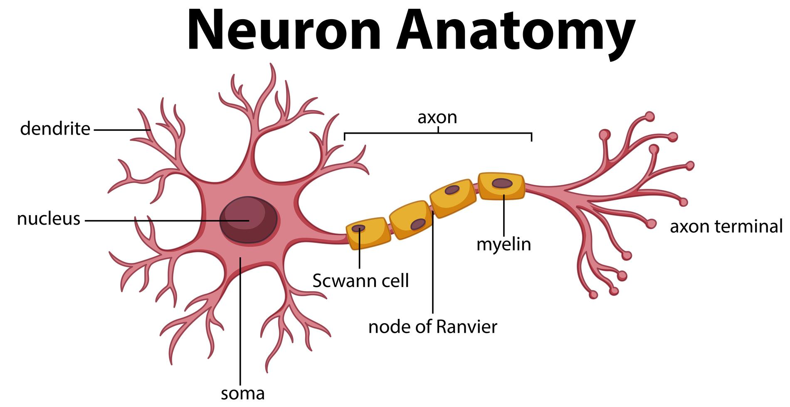

*(Figure 1: Diagram of a biological neuron detailing the dendrites, nucleus, and axon)*

> [!NOTE]  
> While biological neurons inspire ANNs, modern artificial neural networks do not attempt to perfectly simulate brain biology. They are mathematical abstractions optimized for computational efficiency.

<details>
<summary><b>Deeper Dive: Neuroplasticity and Learning</b></summary>
<br>
Learning in biological systems is largely attributed to <i>neuroplasticity</i>—the brain's ability to modify its connections. When neurons fire together repeatedly, the synapse (the connection) between them strengthens. This biological concept, summarized by the phrase "neurons that fire together, wire together" (Hebb's rule), is directly analogous to how Artificial Neural Networks adjust their mathematical "weights" during the training phase.
</details>

---

## 2. The Basic Unit: The Artificial Neuron (Perceptron)

The foundational unit of an Artificial Neural Network is the artificial neuron. One of the earliest mathematical models of an artificial neuron is the **Perceptron**, introduced by Frank Rosenblatt in 1958. The perceptron serves as a simplified, linear computational model of its biological counterpart.

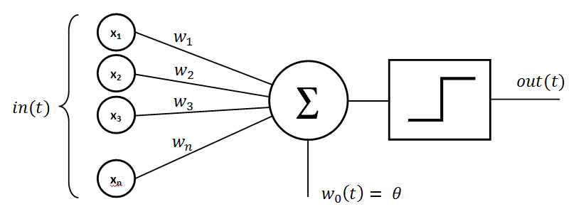

*(Figure 2: Architecture of a Perceptron, illustrating inputs, weights, summation, bias, activation function, and output)*

**Mathematical Model of a Perceptron:**

1.  **Inputs ($x$):** The perceptron accepts a vector of numerical inputs $(x_1, x_2, ..., x_n)$. In practical applications, these represent features of the dataset (e.g., pixel intensities in an image). This corresponds to biological dendrites.
2.  **Weights ($w$):** Every input is multiplied by a corresponding weight $(w_1, w_2, ..., w_n)$. Weights represent the signal strength of a specific input connection. A positive weight implies an excitatory connection; a negative weight implies an inhibitory connection.
3.  **Summation and Bias ($b$):** The perceptron calculates the weighted sum of its inputs. To control the activation threshold effectively, a constant term called a **bias** ($b$) is added to the sum. 
    *   $\text{Weighted Sum} = (x_1w_1 + x_2w_2 + ... + x_nw_n) + b$
4.  **Activation Function:** The resulting sum is passed through an **activation function** to determine the final output. The original perceptron utilized a **Heaviside step function**:
    *   If $\text{Sum} \ge 0$, the output is 1.
    *   If $\text{Sum} < 0$, the output is 0.
5.  **Output:** The discrete value returned by the activation function serves as the final output.

> [!IMPORTANT]  
> **The Role of the Bias:** The bias is critical because it allows the activation threshold to shift left or right on the mathematical plane. Without a bias, the perceptron's decision boundary would be forced to pass exactly through the origin $(0,0)$, severely limiting the types of functions it could model.

<details>
<summary><b>Mathematical Context: Vector Notation (The Dot Product)</b></summary>
<br>
In computer science and linear algebra, the weighted sum $(x_1w_1 + x_2w_2 + ... + x_nw_n)$ is rarely calculated using loops. Instead, it is expressed as the <b>dot product</b> of two vectors. 
<br><br>
If $\mathbf{x}$ is the input vector and $\mathbf{w}$ is the weight vector, the calculation is written as:
<br>
$z = \mathbf{w} \cdot \mathbf{x} + b$
<br><br>
Libraries like NumPy (used in the subsequent section) optimize this dot product at the hardware level, which is why neural networks rely heavily on parallel matrix multiplication.
</details>

---

## 3. Simple Computations: Modeling Logic Gates (AND, OR, NOT)

Because a single perceptron calculates a linear function, it can perform basic mathematical computations and model standard Boolean logic gates. 

The following Python code implements a perceptron computationally:

```python
import numpy as np

def perceptron(inputs, weights, bias):
    """Calculates the output of a basic linear perceptron utilizing a step function."""
    assert len(inputs) == len(weights), "Input and weight vectors must be of equal length."

    # Calculate the dot product of inputs and weights, then add the bias
    weighted_sum = np.dot(inputs, weights) + bias 

    # Apply the step activation function
    if weighted_sum >= 0:
        return 1
    else:
        return 0
```

> [!TIP]  
> **Code Experimentation:** You can run this code in a Jupyter Notebook or any standard Python environment. Try altering the weights and biases slightly to see how the outputs change.

By defining specific static weights and biases, this generalized perceptron function acts as different logical gates.

### OR Gate
The OR function outputs 1 if at least one input is 1.
```python
# Configuration for an OR Gate
weights_or = [1.0, 1.0]
bias_or = -0.5
inputs = [[0,0], [0,1], [1,0], [1,1]]

print("--- OR Gate Output ---")
for input_pair in inputs:
    output = perceptron(input_pair, weights_or, bias_or)
    print(f"Input: {input_pair}, Output: {output}")
```

<details>
<summary><b>Why this works (Mathematical Breakdown for OR)</b></summary>
<br>
The perceptron evaluates the inequality: $1.0(x_1) + 1.0(x_2) - 0.5 \ge 0$.
<ul>
<li>If input is [0, 0]: $0 + 0 - 0.5 = -0.5$ (Less than 0 $\rightarrow$ Output 0)</li>
<li>If input is [1, 0]: $1.0 + 0 - 0.5 = 0.5$ (Greater than 0 $\rightarrow$ Output 1)</li>
<li>If input is [0, 1]: $0 + 1.0 - 0.5 = 0.5$ (Greater than 0 $\rightarrow$ Output 1)</li>
<li>If input is [1, 1]: $1.0 + 1.0 - 0.5 = 1.5$ (Greater than 0 $\rightarrow$ Output 1)</li>
</ul>
</details>

### AND Gate
The AND function outputs 1 strictly when both inputs are 1.
```python
# Configuration for an AND Gate
weights_and = [1.0, 1.0]
bias_and = -1.5
inputs = [[0,0], [0,1], [1,0], [1,1]]

print("\n--- AND Gate Output ---")
for input_pair in inputs:
    output = perceptron(input_pair, weights_and, bias_and)
    print(f"Input: {input_pair}, Output: {output}")
```

<details>
<summary><b>Why this works (Mathematical Breakdown for AND)</b></summary>
<br>
The perceptron evaluates the inequality: $1.0(x_1) + 1.0(x_2) - 1.5 \ge 0$.
<br>
Unlike the OR gate, a single input of 1 yields $1.0 - 1.5 = -0.5$ (Output 0). It strictly requires both inputs to be 1 to yield $2.0 - 1.5 = 0.5$, successfully crossing the zero threshold to output 1.
</details>

### NOT Gate
The NOT function inverts a single input.
```python
# Configuration for a NOT Gate
weights_not = [-1.0]
bias_not = 0.5
inputs = [[0], [1]] 

print("\n--- NOT Gate Output ---")
for input_val in inputs:
    output = perceptron(input_val, weights_not, bias_not)
    print(f"Input: {input_val}, Output: {output}")
```

---

## 4. The Limitation: Linear Separability and the XOR Problem

While the single-layer perceptron successfully models basic logic gates, it possesses a fundamental theoretical limitation regarding the types of data it can classify. This limitation is defined by the concept of **linear separability**.

When data points for logical AND or OR operations are plotted on a Cartesian plane, it is possible to draw a single, straight line (a hyperplane) that perfectly separates the coordinates resulting in an output of 1 from those resulting in an output of 0. Data sets that can be separated in this manner are *linearly separable*. 

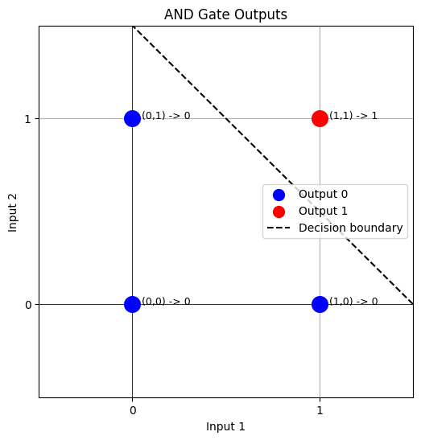

*(Figure 3: Linearly separable data. A single hyperplane can successfully divide the two output classes.)*

However, the perceptron mathematically fails when presented with the **XOR (Exclusive OR)** function. The XOR logic gate outputs 1 if the inputs are mutually exclusive (one is 1, the other is 0), and outputs 0 if the inputs are identical.

| Input 1 | Input 2 | Output |
| :------ | :------ | :----- |
| 0       | 0       | 0      |
| 0       | 1       | 1      |
| 1       | 0       | 1      |
| 1       | 1       | 0      |

When plotting the XOR outputs, the data points form a diagonal opposition. 

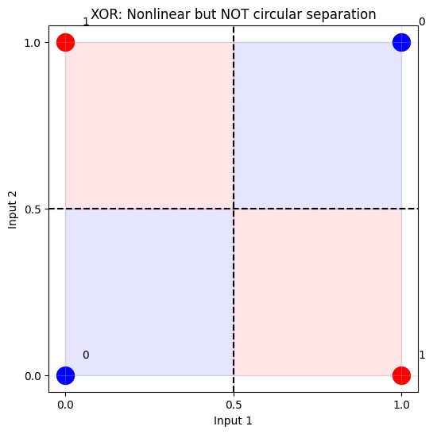

*(Figure 4: Non-linearly separable data representing the XOR problem. No single linear boundary can separate the output classes.)*

Because the underlying mathematics of a single perceptron ($\mathbf{w} \cdot \mathbf{x} + b = 0$) exclusively define a linear boundary, a single perceptron is mathematically incapable of solving the XOR problem. 

> [!IMPORTANT]  
> **Historical Impact (The "AI Winter"):** This specific mathematical limitation was formally proven by Marvin Minsky and Seymour Papert in their 1969 book *Perceptrons*. Because most real-world data is non-linear, this proof led to heavy skepticism regarding neural networks, causing a significant decline in funding and research during the 1970s—a period often referred to as the first "AI Winter."

<details>
<summary><b>Conceptual Preview: How to overcome the XOR limitation</b></summary>
<br>
If a single straight line cannot solve XOR, how is it solved? The solution requires drawing <i>multiple</i> lines and combining their results.
<br><br>
In architectural terms, this means combining multiple perceptrons together. You can mathematically construct an XOR gate by combining an OR gate, a NAND (NOT-AND) gate, and an AND gate. This requires routing the outputs of the first set of perceptrons into the inputs of a final perceptron. This concept introduces <b>hidden layers</b>, which leads to the next topic: Multi-Layer Perceptrons.
</details>


---

## 5. Building Bigger Brains: Overcoming Limitations with Multi-Layer Networks (MLPs)

To overcome the mathematical limitations of the single-layer perceptron regarding non-linearly separable data, artificial neurons must be connected in multiple, stacked layers. This architectural expansion forms a **Multi-Layer Perceptron (MLP)**, also known generally as a Feedforward Neural Network.

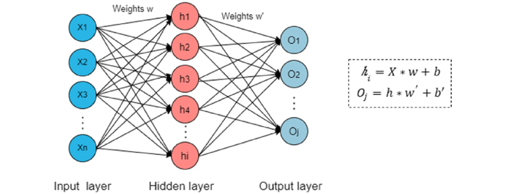

*(Figure 5a: The basic structure of MLP, including input layer, hidden layer, and output layer.)*


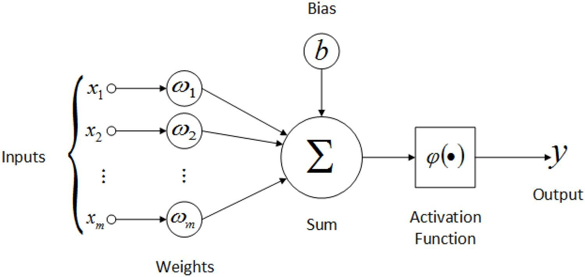

*(Figure 5b: Diagram of a modern artificial neuron utilized in hidden layers, featuring non-linear activation functions.)*

> [!IMPORTANT]  
> **A Historical Misnomer:** Despite the name "Multi-Layer Perceptron," the nodes within the hidden and output layers of modern MLPs are not standard perceptrons. They do not use the Heaviside step function; instead, they utilize continuous, non-linear activation functions to allow for complex mathematical optimization.

**Architectural Structure of an MLP:**

1.  **Input Layer:** A passive layer that receives the initial feature vectors from the dataset. It performs no computation; it simply passes data to the next layer.
2.  **Hidden Layer(s):** One or more intermediate layers of neurons. These layers are responsible for extracting patterns and transforming the data into complex representations. The capacity to handle non-linearly separable data is directly attributed to these layers.
3.  **Output Layer:** The final layer that produces the network's continuous or discrete prediction (e.g., a probability score for classification or a continuous value for regression).

**Advanced Activation Functions:**
To effectively learn complex patterns, hidden layers replace the step function with continuous, differentiable [**activation functions**](https://developers.google.com/machine-learning/crash-course/neural-networks/activation-functions#common_activation_functions). 

*   **Sigmoid:** Maps input values into a bounded range between 0 and 1. Formula: $f(x) = \frac{1}{1 + e^{-x}}$

    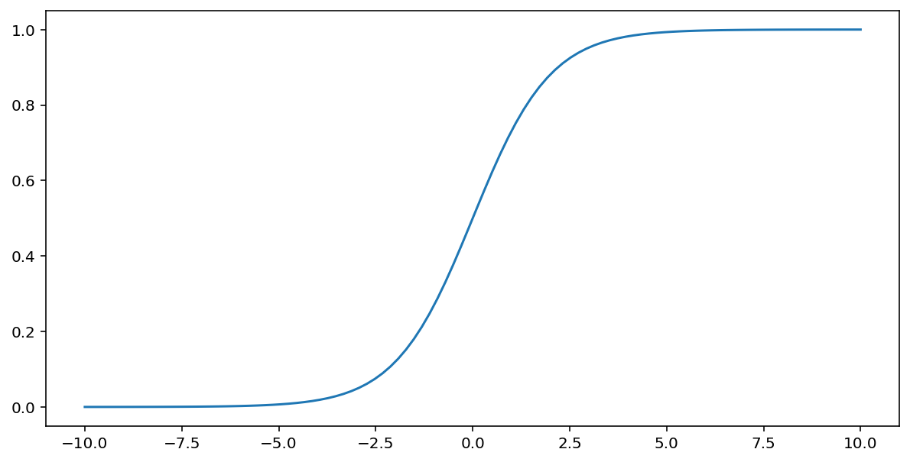

*   **Tanh (Hyperbolic Tangent):** Maps input values into a bounded range between -1 and 1, centered at zero. Formula: $f(x) = \frac{e^x - e^{-x}}{e^x + e^{-x}}$

    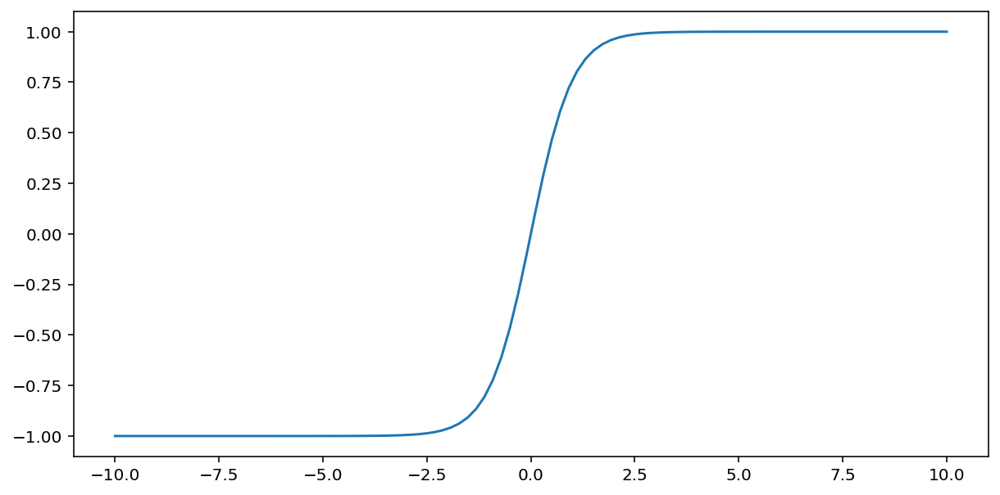

*   **ReLU (Rectified Linear Unit):** Outputs the input directly if it is positive, and outputs zero if it is negative. Formula: $f(x) = \max(0, x)$

    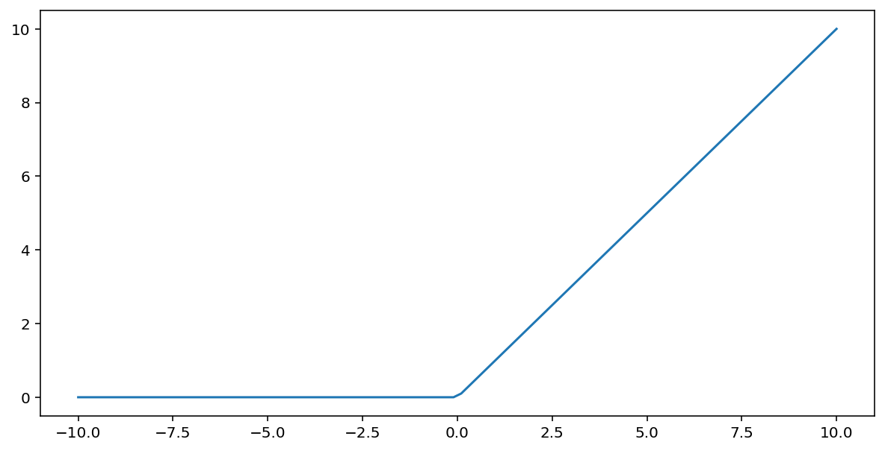

<details>
<summary><b>Deeper Dive: The Mathematical Necessity of Non-Linearity</b></summary>
<br>
Why are non-linear activation functions strictly required in hidden layers? 
<br><br>
In linear algebra, the composition of multiple linear functions is simply another linear function. If an MLP used only linear activation functions (or no activation functions at all), multiplying the weight matrices across multiple layers would mathematically collapse into a single equivalent weight matrix. 
<br><br>
By introducing non-linear transformations (like ReLU or Tanh) at each layer, the network is capable of warping and bending the mathematical space, allowing it to draw highly complex, curved decision boundaries necessary for tasks like image recognition and natural language processing.
</details>

---

## 6. How Networks Learn: Forward and Backward Passes

An established MLP architecture must be optimized—or "trained"—to yield accurate predictions. Training is an iterative computational process that relies on a dataset containing known inputs and expected targets. The process alternates between two phases: the **Forward Pass** and the **Backward Pass**.

### Forward Pass: Computing Predictions

The forward pass is the sequential calculation of the network's output given a specific input vector and the *current* state of its weights and biases.

1.  Input vectors are introduced to the **input layer**.
2.  The data propagates forward through the hidden layers. At each discrete neuron:
    *   The dot product of the input vector and the neuron's weight vector is calculated, and the bias is added ($z = \mathbf{w} \cdot \mathbf{x} + b$).
    *   The scalar result ($z$) is passed through the chosen activation function.
    *   The resulting outputs serve as the input vector for the subsequent layer.
3.  This propagation concludes at the **output layer**, yielding the network's prediction.

Prior to training, weights and biases are initialized randomly. Consequently, initial forward passes yield highly inaccurate predictions.

### Backward Pass: Parameter Optimization (Backpropagation & Gradient Descent)

The backward pass systematically adjusts the network's internal parameters (weights and biases) to minimize the discrepancy between the network's prediction and the actual target value.

1.  **Error Calculation:** The discrepancy is quantified using a **loss function** (e.g., Mean Squared Error for continuous data, or Cross-Entropy for categorical data). This provides a scalar value representing the current error magnitude.
2.  **Backpropagation:** To minimize the loss, the algorithm must determine how sensitive the total error is to each individual weight and bias. Backpropagation computes the **gradient** (the vector of partial derivatives) of the loss function with respect to every parameter in the network, working backward from the output layer to the input layer.
3.  **Gradient Descent:** Once the gradients are computed, the parameters are updated. The algorithm subtracts a fraction of the gradient from the current parameter value, moving it in the direction that most steeply decreases the error.

> [!TIP]  
> **The Learning Rate ($\eta$):** The update rule is defined as $w_{new} = w_{old} - \eta \cdot \nabla L$. The **learning rate ($\eta$)** is a hyperparameter determining the step size. If $\eta$ is too high, the algorithm may overshoot the optimal minimum. If $\eta$ is too low, training becomes computationally expensive and slow.

<details>
<summary><b>Mathematical Context: Backpropagation and the Chain Rule</b></summary>
<br>
Backpropagation is fundamentally an application of the <b>Chain Rule</b> from multivariate calculus. Because a neural network is a nested sequence of functions (the activation of layer 3 depends on layer 2, which depends on layer 1), calculating the derivative of the final loss with respect to a weight in the first layer requires differentiating through all intermediate layers.
<br><br>
Formulaically: $\frac{\partial \text{Loss}}{\partial w_1} = \frac{\partial \text{Loss}}{\partial \text{Output}} \cdot \frac{\partial \text{Output}}{\partial \text{Hidden}} \cdot \frac{\partial \text{Hidden}}{\partial w_1}$
</details>

### Visualizing Parameter Optimization: Gradient Descent

The following examples utilize Python to visualize how gradient descent iteratively locates the minimum of a mathematical loss function.

**Code Example & Visualization: 2D Gradient Descent**

This script demonstrates optimizing a single parameter ($x$) to minimize a quadratic loss function ($L = x^2$).

```python
import numpy as np
import matplotlib.pyplot as plt

def loss_function(x):
    """A standard quadratic loss curve."""
    return x**2

def gradient_descent_2d(learning_rate, epochs):
    x = 10  # Initial random parameter state
    x_values, loss_values = [x], [loss_function(x)] 
    
    for _ in range(epochs):
        gradient = 2 * x  # The analytical derivative of x^2
        x = x - learning_rate * gradient  # Update rule
        x_values.append(x)
        loss_values.append(loss_function(x))
    return x_values, loss_values

# Execution
learning_rate = 0.1
epochs = 20
x_vals, loss_vals = gradient_descent_2d(learning_rate, epochs)

# Visualization plotting logic
plt.figure(figsize=(10, 6))
x_curve = np.linspace(-11, 11, 100)
plt.plot(x_curve, loss_function(x_curve), 'g-', label='Loss Function ($x^2$)') 
plt.plot(x_vals, loss_vals, 'r-o', label='Gradient Descent Path') 
plt.title('2D Gradient Descent Optimization')
plt.xlabel('Parameter ($x$)')
plt.ylabel('Loss magnitude')
plt.grid(True)
plt.legend()
plt.show()
```
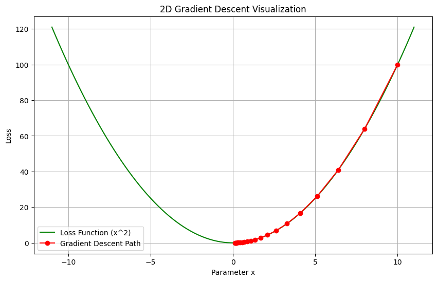

*(Figure 6: A 2D visualization of gradient descent algorithm descending a quadratic loss curve.)*

<details>  
<summary><b>Code Example & Visualization: 3D Gradient Descent</b></summary>
<br>
This script demonstrates optimizing two parameters ($x, y$) simultaneously to minimize a multivariate loss function ($L = x^2 + y^2$).

```python
from mpl_toolkits.mplot3d import Axes3D
import matplotlib.lines as mlines

def loss_function_3d(x, y):
    return x**2 + y**2

def gradient_descent_3d(learning_rate, epochs):
    x, y = 10, 10  # Initial parameters
    x_vals, y_vals, loss_vals = [x], [y], [loss_function_3d(x, y)]
    
    for _ in range(epochs):
        gradient_x = 2 * x  # Partial derivative w.r.t x
        gradient_y = 2 * y  # Partial derivative w.r.t y
        
        # Update rule applied to both parameters
        x = x - learning_rate * gradient_x 
        y = y - learning_rate * gradient_y 
        
        x_vals.append(x); y_vals.append(y); loss_vals.append(loss_function_3d(x, y))
    return x_vals, y_vals, loss_vals

# Execution
learning_rate = 0.1
epochs = 20
x_vals, y_vals, loss_vals = gradient_descent_3d(learning_rate, epochs)

# Visualization plotting logic
X, Y = np.meshgrid(np.linspace(-12, 12, 100), np.linspace(-12, 12, 100))
Z = loss_function_3d(X, Y)

fig = plt.figure(figsize=(12, 8))
ax = fig.add_subplot(111, projection='3d')
ax.plot_surface(X, Y, Z, cmap='viridis', alpha=0.6)
ax.plot(x_vals, y_vals, loss_vals, 'r-o', markersize=5)
ax.set_title('3D Gradient Descent Optimization')
ax.set_xlabel('Parameter $x$'); ax.set_ylabel('Parameter $y$'); ax.set_zlabel('Loss')
plt.show()
```
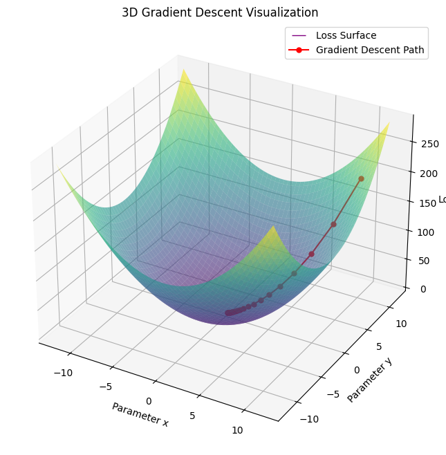

*(Figure 7: A 3D visualization illustrating simultaneous multi-parameter optimization across a loss surface.)*
</details>  

---

## 7. Key Terminology Recap

*   **Artificial Neuron:** The fundamental computational unit within an artificial neural network.
*   **Perceptron:** An early mathematical model of a single artificial neuron utilizing a Heaviside step activation function; restricted to solving linearly separable problems.
*   **Weights & Biases:** The internal, adjustable parameters of a network. Weights define the magnitude of input importance, whereas the bias acts as a constant scalar offset for the activation threshold.
*   **Activation Function:** A mathematical operation applied to the weighted sum of inputs. Continuous, non-linear functions (e.g., Sigmoid, ReLU) are required to model complex data structures.
*   **Linear Separability:** A condition wherein distinct data classes can be accurately segregated by a single linear hyperplane.
*   **Multi-Layer Perceptron (MLP):** A Feedforward Neural Network architecture comprising an input layer, one or more hidden layers, and an output layer.
*   **Forward Pass:** The sequential mathematical evaluation of input data propagating through the network layers to produce a prediction.
*   **Backward Pass:** The optimization phase wherein network parameters are adjusted to minimize output error.
    *   **Loss Function:** A mathematical function that quantifies the discrepancy between the network's current prediction and the actual target value.
    *   **Backpropagation:** An algorithmic application of the chain rule used to calculate the gradient of the loss function with respect to every parameter.
    *   **Gradient Descent:** An optimization algorithm that iteratively updates network parameters in the opposite direction of the calculated gradients.
*   **Learning Rate:** A defined scalar hyperparameter that limits the magnitude of parameter adjustments during gradient descent.

---

## 8. Further Exploration

For further academic study and practical experimentation with neural network architectures, the following resources are recommended:

- **Interactive Modeling:** [TensorFlow Playground](https://playground.tensorflow.org/) - A browser-based interface for visualizing neural network behavior, parameter adjustment, and decision boundary formation.
- **Mathematical Foundations:** [Notes on Single-Layer Neural Networks](https://humphryscomputing.com/Notes/Neural/single.neural.html)
- **University Course Materials:** [UW Madison Data Science: Neural Networks Overview](https://uw-madison-datascience.github.io/2022-10-26-machine-learning-novice-sklearn/06-neural-networks/index.html)
- **Applied Deep Learning:** [Kaggle Introduction to Deep Learning](https://www.kaggle.com/learn/intro-to-deep-learning)
- **Google Developer Documentation:** [Machine Learning Crash Course – Activation Functions](https://developers.google.com/machine-learning/crash-course/neural-networks/activation-functions)


---

<details>
<summary><b>Python Code for AND OR and XOR Data Visualization</b></summary>

Here's the Python code to generate the scatter plots for the AND data points:

```python
import matplotlib.pyplot as plt
import numpy as np

# Define the input points (corners of the unit square)
inputs = np.array([[0, 0], [0, 1], [1, 0], [1, 1]])
x_coords = inputs[:, 0]
y_coords = inputs[:, 1]

# AND outputs
outputs_and = np.array([0, 0, 0, 1])

# Colors: 0 -> blue, 1 -> red
colors = ['blue', 'red']

# --- Plot AND Gate ---
plt.figure(figsize=(6, 6))
plt.title('AND Gate Outputs')
plt.xlabel('Input 1')
plt.ylabel('Input 2')

# Plot points
for i in range(len(inputs)):
    plt.scatter(
        x_coords[i], y_coords[i],
        color=colors[outputs_and[i]],
        s=200,
        zorder=3
    )

# Labels
for i in range(len(inputs)):
    plt.text(
        x_coords[i] + 0.05,
        y_coords[i],
        f'({x_coords[i]},{y_coords[i]}) -> {outputs_and[i]}',
        fontsize=9
    )

# --- Decision boundary for AND ---
# x1 + x2 = 1.5  -> x2 = 1.5 - x1
x = np.linspace(-0.5, 1.5, 100)
y = 1.5 - x
plt.plot(x, y, 'k--', label='Decision boundary')

# Axis styling
plt.xticks([0, 1])
plt.yticks([0, 1])
plt.xlim(-0.5, 1.5)
plt.ylim(-0.5, 1.5)
plt.grid(True, zorder=0)
plt.axhline(0, color='black', linewidth=0.5)
plt.axvline(0, color='black', linewidth=0.5)

# Legend
legend_handles = [
    plt.scatter([], [], color='blue', s=100, label='Output 0'),
    plt.scatter([], [], color='red', s=100, label='Output 1'),
    plt.Line2D([0], [0], linestyle='--', color='black', label='Decision boundary')
]

plt.legend(handles=legend_handles, loc='center right')

plt.show()
```

Here's the Python code to generate the scatter plots for the OR data points:

```python
import matplotlib.pyplot as plt
import numpy as np

# Inputs (unit square corners)
inputs = np.array([[0, 0], [0, 1], [1, 0], [1, 1]])
x_coords = inputs[:, 0]
y_coords = inputs[:, 1]

# OR outputs
outputs_or = np.array([0, 1, 1, 1])

# Colors: 0 -> blue, 1 -> red
colors = ['blue', 'red']

# --- Plot OR Gate ---
plt.figure(figsize=(6, 6))
plt.title('OR Gate Outputs')
plt.xlabel('Input 1')
plt.ylabel('Input 2')

# Plot points
for i in range(len(inputs)):
    plt.scatter(
        x_coords[i], y_coords[i],
        color=colors[outputs_or[i]],
        s=200,
        zorder=3
    )

# Labels
for i in range(len(inputs)):
    plt.text(
        x_coords[i] + 0.05,
        y_coords[i],
        f'({x_coords[i]},{y_coords[i]}) -> {outputs_or[i]}',
        fontsize=9
    )

# --- Decision boundary for OR ---
# One valid separator: x1 + x2 = 0.5
# (anything above this line is class 1)
x = np.linspace(-0.5, 1.5, 100)
y = 0.5 - x
plt.plot(x, y, 'k--', label='Decision boundary')

# Axes styling
plt.xticks([0, 1])
plt.yticks([0, 1])
plt.xlim(-0.5, 1.5)
plt.ylim(-0.5, 1.5)
plt.grid(True, zorder=0)
plt.axhline(0, color='black', linewidth=0.5)
plt.axvline(0, color='black', linewidth=0.5)

# Legend
legend_handles = [
    plt.scatter([], [], color='blue', s=100, label='Output 0'),
    plt.scatter([], [], color='red', s=100, label='Output 1'),
    plt.Line2D([0], [0], linestyle='--', color='black', label='Decision boundary')
]

plt.legend(handles=legend_handles, loc='center right')

plt.show()
```

Here's the Python code to generate the scatter plots for the XOR data points:

```python
import matplotlib.pyplot as plt
import numpy as np

# XOR points
inputs = np.array([
    [0, 0],
    [0, 1],
    [1, 0],
    [1, 1]
])

labels = np.array([0, 1, 1, 0])

colors = ['blue', 'red']

plt.figure(figsize=(6, 6))
plt.title("XOR: Nonlinear separation")
plt.xlabel("Input 1")
plt.ylabel("Input 2")

# plot points
for i in range(len(inputs)):
    x, y = inputs[i]
    plt.scatter(x, y, color=colors[labels[i]], s=250)
    plt.text(x + 0.05, y + 0.05, str(labels[i]))

plt.axvline(0.5, color='black', linestyle='--')
plt.axhline(0.5, color='black', linestyle='--')

# highlight quadrants
plt.fill_between([0, 0.5], 0, 0.5, color='blue', alpha=0.1)
plt.fill_between([0.5, 1], 0.5, 1, color='blue', alpha=0.1)
plt.fill_between([0, 0.5], 0.5, 1, color='red', alpha=0.1)
plt.fill_between([0.5, 1], 0, 0.5, color='red', alpha=0.1)

plt.xticks([0, 0.5, 1])
plt.yticks([0, 0.5, 1])
plt.grid(True, alpha=0.3)

plt.show()
```


<!-- 
Here's the Python code using Matplotlib to generate the scatter plots for the AND and XOR data points:

```python
import matplotlib.pyplot as plt
import numpy as np

# Define the input points (corners of the unit square)
inputs = np.array([[0, 0], [0, 1], [1, 0], [1, 1]])
x_coords = inputs[:, 0] # First column (Input 1)
y_coords = inputs[:, 1] # Second column (Input 2)

# Define the outputs for AND and XOR
outputs_and = np.array([0, 0, 0, 1])
outputs_xor = np.array([0, 1, 1, 0])

# Define colors for visualization (e.g., blue for 0, red for 1)
colors = ['blue', 'red']

# --- Plotting AND Gate ---
plt.figure(figsize=(6, 6))
plt.title('AND Gate Outputs')
plt.xlabel('Input 1')
plt.ylabel('Input 2')

# Plot points based on their output class
for i in range(len(inputs)):
    plt.scatter(x_coords[i], y_coords[i],
                color=colors[outputs_and[i]], # Color determined by AND output
                s=200, # Size of points
                zorder=3) # Plot points on top of gridlines

# Add text labels for clarity (optional)
for i in range(len(inputs)):
    plt.text(x_coords[i] + 0.05, y_coords[i], f'({x_coords[i]},{y_coords[i]}) -> {outputs_and[i]}', fontsize=9)

# Customize plot appearance
plt.xticks([0, 1])
plt.yticks([0, 1])
plt.xlim(-0.5, 1.5)
plt.ylim(-0.5, 1.5)
plt.grid(True, zorder=0) # Grid behind points
plt.axhline(0, color='black', linewidth=0.5)
plt.axvline(0, color='black', linewidth=0.5)

# Create legend handles manually
legend_handles = [plt.scatter([], [], color='blue', s=100, label='Output 0'),
                  plt.scatter([], [], color='red', s=100, label='Output 1')]
plt.legend(handles=legend_handles, loc='center right')

plt.show()


# --- Plotting XOR Gate ---
plt.figure(figsize=(6, 6))
plt.title('XOR Gate Outputs')
plt.xlabel('Input 1')
plt.ylabel('Input 2')

# Plot points based on their output class
for i in range(len(inputs)):
    plt.scatter(x_coords[i], y_coords[i],
                color=colors[outputs_xor[i]], # Color determined by XOR output
                s=200,
                zorder=3)

# Add text labels for clarity (optional)
for i in range(len(inputs)):
     plt.text(x_coords[i] + 0.05, y_coords[i], f'({x_coords[i]},{y_coords[i]}) -> {outputs_xor[i]}', fontsize=9)


# Customize plot appearance
plt.xticks([0, 1])
plt.yticks([0, 1])
plt.xlim(-0.5, 1.5)
plt.ylim(-0.5, 1.5)
plt.grid(True, zorder=0)
plt.axhline(0, color='black', linewidth=0.5)
plt.axvline(0, color='black', linewidth=0.5)

# Reuse legend handles from above
plt.legend(handles=legend_handles, loc='center right')

plt.show()
```

This code will generate two separate plots:

1.  **AND Plot:** Shows the four input points, colored according to the AND output ( (1,1) will be red, the others blue). You can clearly see these points *are* linearly separable.
2.  **XOR Plot:** Shows the four input points, colored according to the XOR output ( (0,1) and (1,0) will be red, (0,0) and (1,1) will be blue). This visually demonstrates the non-linear separability challenge. 
-->

</details>


<!-- 
- https://carpentries-incubator.github.io/machine-learning-novice-sklearn/07-neural-networks/index.html
- Practical NN with Scikit-Learn:** [Stack Abuse Tutorial](https://stackabuse.com/introduction-to-neural-networks-with-scikit-learn/) 
-->
